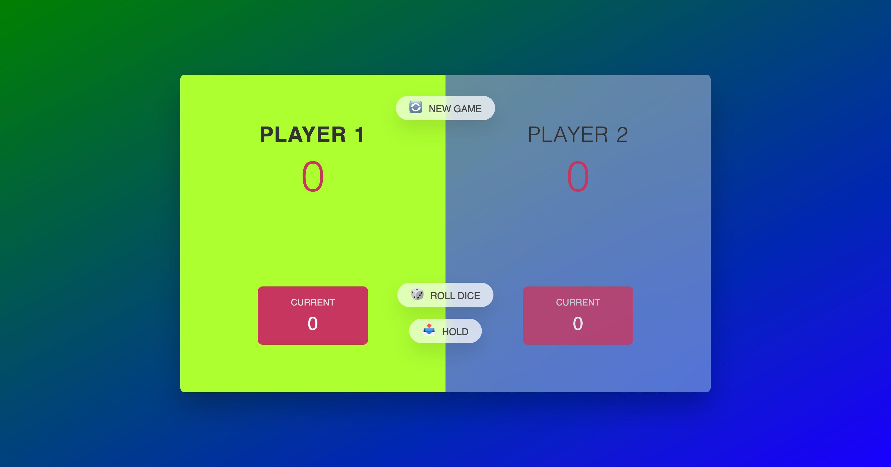
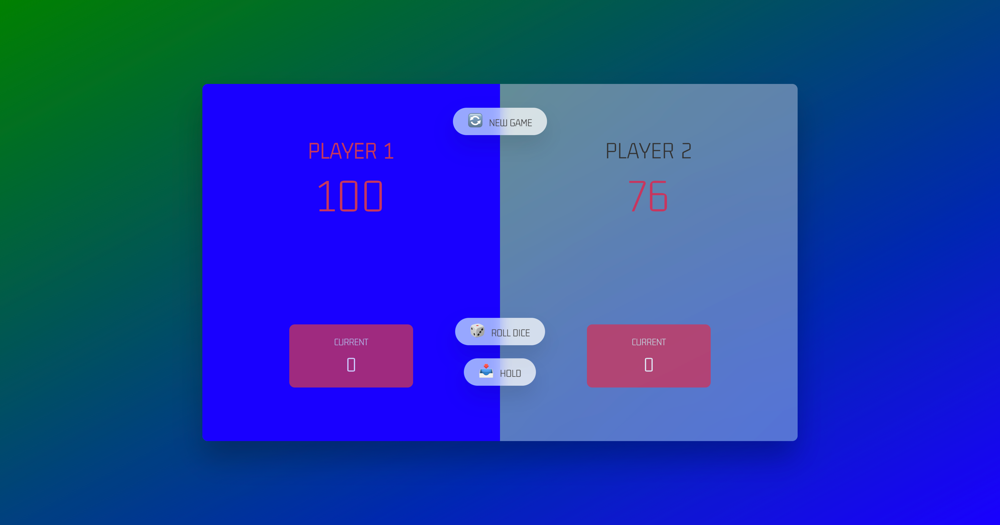

# pig-game
This is a simple dice game called Pig Game.
This game can be played by two (2) player and the first player to reach a total score of 100 or above wins the game



## Built With

- HTML, CSS & JavaScript
- Visual Studio, Git, & GitHub;

## Getting Started

To run this project, you only need a computer with a browser (like Google Chrome, Mozilla Firefox, Microsoft Edge, Apple Safari, etc.) installed, and follow these steps:

1. In your terminal, in the folder of your preference, type the following bash command to clone this repository:

```sh
git@github.com:fortuneonyeka/pig-game.git
```

2. Now that you have already cloned the repo run the following commands to get the project up and running:
```sh
cd pig-game
run live-server
```

3. Next, you can start playing the game by clicking "NEW GAME" button, with Hold score, you can update your total score and the first player to reach 100 or above total score wins the game. You can stop your local server at any time hitting `<Ctrl> + C` on your keyboard.

## Author

👤 **Ihedoro Fortunatus O**

- GitHub: [@fortuneonyeka](https://github.com/fortuneonyeka)
- Twitter: [@onyekafortune](https://twitter.com/onyekafortune)
- LinkedIn: [Ihedoro Fortunatus](https://www.linkedin.com/in/fortunatus-ihedoro/)

## 🤝 Contributing

Contributions, issues, and feature requests are welcome!

## Show your support

Give a ⭐️ if you like this project!

## 📝 License

This project is [MIT](./LICENSE) licensed.